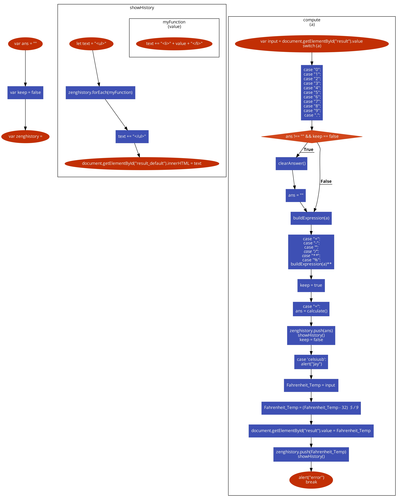

## This performs Power and modulo 
---
Algorithm 1. Compute(first, second, operator)

Input: first is a double, second is a double, operator is a string and can be "**" or "%".

LET result
    IF (operator == "**") THEN
        result = first ** second
    IF (operator == "%") THEN
        result = first % second   
Output: The result

## This performs  square/cube roots operations 
---
Algorithm 2. Compute(input, operator)

Input: input is a double, operator is a string and can be "sqrt" or "cbrt".

LET result   
    IF (operator == "sqrt") THEN
        result = calculate the square root of the input
    IF (operator == "cbrt") THEN
        result = caluculate the cube root of the input   
Output: The result

## This displays all the results
---

Algorithm 3. ShowHistory(result)

Input: result is a string

    LET myHistory is an array 
    Add result to array
    Display all the elements of myHistory to user
Output:myHistory

